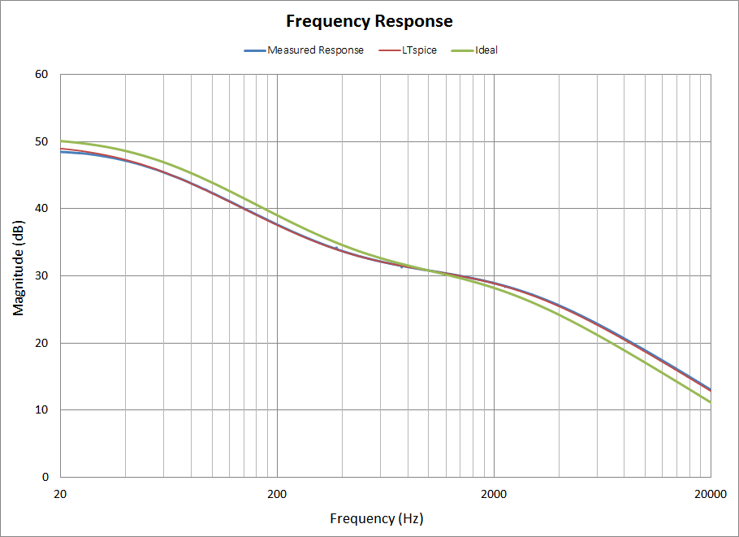
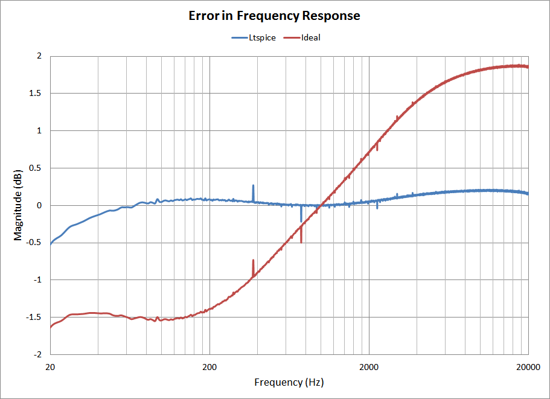
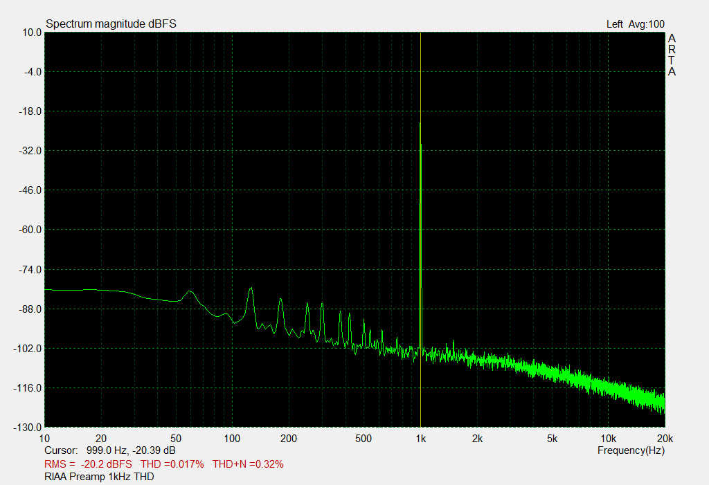
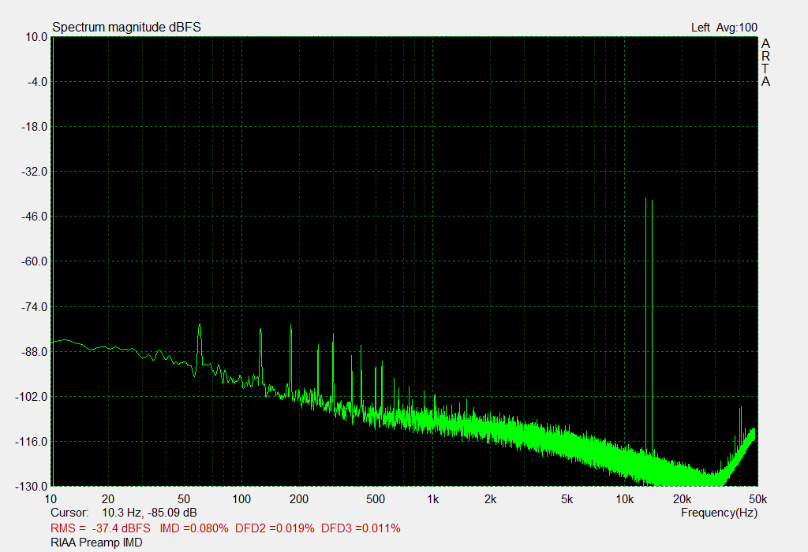

# RIAA Phono Preamp
## V1.0 Characteristics and Performance.
To characterize the performance of the preamp tests were performed using the [ARTA](http://www.artalabs.hr/) software package. This summary of results is divided into frequency response and distortion.

## Frequency Response.
The frequency response was measured using ARTA, and the data was compared against the ideal response and against an LTSpice simulation of the signal chain. A comparison between the right and left channel was also performed. All values were normalized at 1 kHz to make comparison consistent.

### Overall Response.

###### Figure 1: Results of frequency measurement

The measured response matches the LTspice simulation so closely that it's data is almost obscured entirely. There is some obvious error when compared with the ideal response. This is one of the goals of version 2. Knowing that the simulation can be trusted to match closely with real world performance should make the job of choosing better component values easier.

### Response Error.

*Figure 2: Relative frequency response*

Figure 2 shows the difference from the measured response to simulated (blue) and the ideal (red). This graph also quantifies what figure 1 had shown before. less than 0.5 dB difference from 20 Hz to 20 kHz for the simulation is very good. The ideal response is not so good, at around 1.5 db too low at low frequencies and almost 2 dB high at high frequencies. This is almost certainly audible difference. 

### Channel Matching.

*Figure 3*

Matching between channels was very good, less than 0.25 dB throughout the range. This is widely considered completely inaudible. While it is hard to draw too many conclusion from a single unit, the results of these tests seems to indicate that there is no need to go to parts of any higher tolerance.

## Distortion.
Three types of distortion were measured for these tests. THD (*Total harmonic distortion*), THD+N (*THD plus noise*), and IMD (*intermodulation distortion*). The harmonic distortion tests were performed at three discrete frequencies, and IMD used the ITU_R standard of 13/14 kHz twin tones at a ratio of 1:1. For more information on audio distortion I recommend starting with [This RANE Audio note](http://www.rane.com/note145.html).

### Harmonic Distortion.

Frequency| THD (%) |THD+N (%)
:-------:|:-------:|: ---:
20 Hz    | 0.046   | 0.074
1 kHz    | 0.017   | 0.32
10 kHz   | 0.023   | 1.38

The overall values are very good. The goal was a hazy 'less than 0.1% would be nice' but I wasn't too sure what to expect. That most values are less than half that was a pleasant surprise. It should be noted that there are two things that may be inflating these figures as well. 
- The 20 Hz test signal is going to count the power supply 60 Hz hum as a harmonic, increasing the value for THD. 
- The THD+N figure is very high at 10 kHZ, and somewhat high at 1 kHz. This is because the input level was optimized where gain was the highest, at 20 Hz. At higher frequencies the gain is much lower so the noise appears as a proportionally larger component in the result. Adjusting the input signal at each frequency is probably how this should be done, and should get better results.

One more note, all of these should be considered 'less than xx%' values. What was measured is technically the sum of the unit and the audio interface that was used. Since the interface itself has very good performance I don't see the need to try to subtract out the small factor.

*Figure 4: Response at 1kHz*

Here you can see the main test tone at 1 kHz, The harmonics are not really even visible. What you can see is noise coming from the power supply, and some of it's harmonics. Down around -85 dB this isn't a huge deal, but I would like to knock this down a fair bit in the next version. 

### Intermodulation Distortion.
IMD (ITU_R): 0.080% 13 kHz/14 kHz, 1:1

The IMD results also show a very low 0.080%. Once again the input signal is still calibrated for 20 Hz region of the response. One thing about IMD is that it sometimes can be worse for lower input signals, so it is possible this value could be "improved" somewhat through test manipulation. For future tests, I will try to perform IMD at several input levels. 

*Figure 5: Results of IMD Test*

In figure 5, you can see the small peak created at on 1 kHz by the twin tones of the IMD test. Most of the spikes on this graph appear at multiples of 60 Hz.

## Summary

Overall, I was quite pleased with the performance of the first version. All numbers aside, There is nothing in the performance that makes it audibly bad. Most of the improvements that are planned for V2 are technical improvements and won't significantly change the listening experience. 
