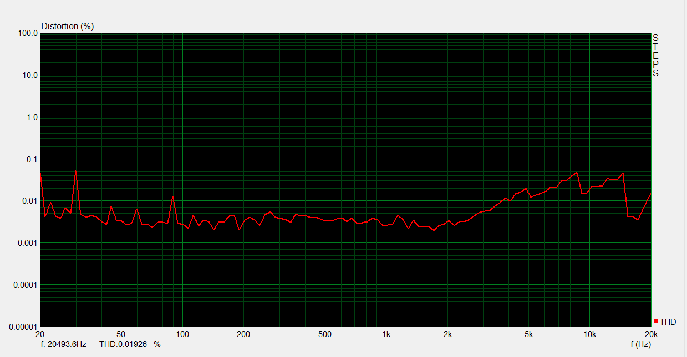

# RIAA Phono Preamp
## V1.0 Characteristics and Performance.
To characterize the performance of the preamp tests were performed using the [ARTA](http://www.artalabs.hr/) software package. This summary of results is divided into frequency response and distortion.

## Frequency Response.
The frequency response was measured using ARTA, and the data was compared against the ideal response and against an LTSpice simulation of the signal chain. A comparison between the right and left channel was also performed. All values were normalized at 1 kHz to make comparison consistent.

### Overall Response.

*Figure 1: Results of frequency measurement.*

The measured response matches the LTspice simulation so closely that it's data is almost obscured entirely. There is some obvious error when compared with the ideal response. This is one of the goals of version 2. Knowing that the simulation can be trusted to match closely with real world performance should make the job of choosing better component values easier.

### Response Error.

*Figure 2: Relative frequency response.*

Figure 2 shows the difference from the measured response to simulated (blue) and the ideal (red). This graph also quantifies what figure 1 had shown before. less than 0.5 dB difference from 20 Hz to 20 kHz for the simulation is very good. The ideal response is not so good, at around 1.5 db too low at low frequencies and almost 2 dB high at high frequencies. This is almost certainly audible difference. 

### Channel Matching.

*Figure 3: Difference between left and right channels.*

## Distortion.
Three types of distortion were measured for these tests. THD (*Total harmonic distortion*), THD+N (*THD plus noise*), and IMD (*intermodulation distortion*). THD was checked for anomalies using steps to measure across the frequency response as seen in Figure 4. Measured values are taken at specific points to measure relative to correct signal levels. IMD uses the ITU_R standard of 19/20 kHz twin tones at a ratio of 1:1. For more information on audio distortion I recommend starting with [This RANE Audio note](http://www.rane.com/note145.html).

### Harmonic Distortion.

| Freq (Hz) | Level (dB) | THD (%) | THD+N (%) |
|-----------|------------|---------|-----------|
|       100 |       -3.0 |  0.0099 |     0.055 |
|      1000 |       -3.3 |  0.0034 |     0.067 |
|     10000 |       -2.9 |   0.025 |     0.073 |

*Figure 4: THD measured across frequency. Due to the non flat frequency response this does not use the preferred -3dB  signal level so final measurements are performed at just a few values.*

### Intermodulation Distortion.

| Freqs  (kHz) | Level (dB) | Magnitude ratio | IMD (%) | standard |
|--------------|------------|-----------------|---------|----------|
| 19/20        |       -3.0 | 1:1             |   0.062 | ITU-R    |

## Noise

The noise level was measured with a 0V input, and taken to be the resulting RMS level. 
The noise figure is dominated by the power supply, with the peak -68.5 dB at 60 Hz nearly equal to the the total noise figure.

|Bandwidth |  Noise   |
|----------|----------|
|  44 kHz  | -67.0 dB |

